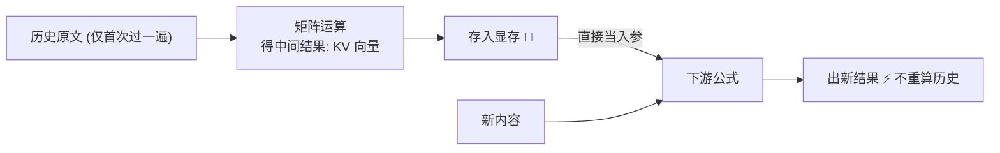
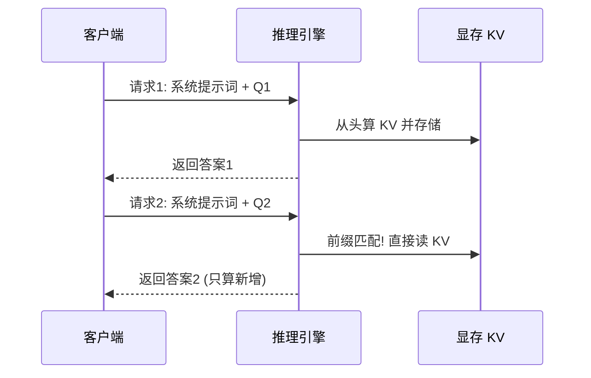
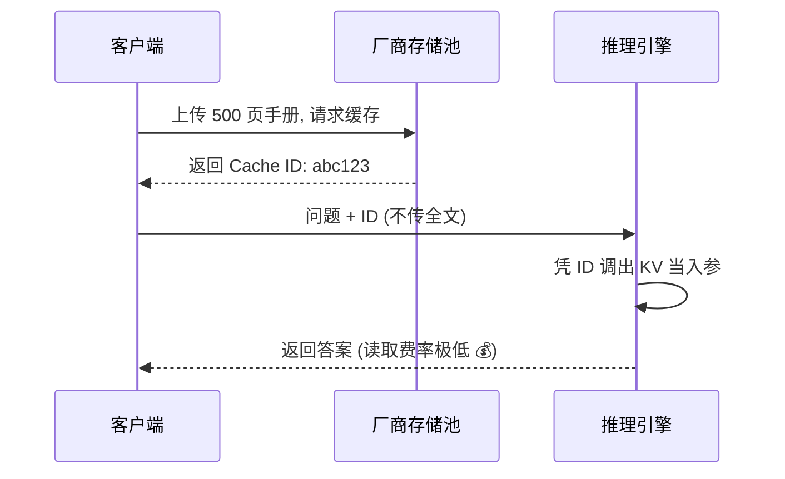
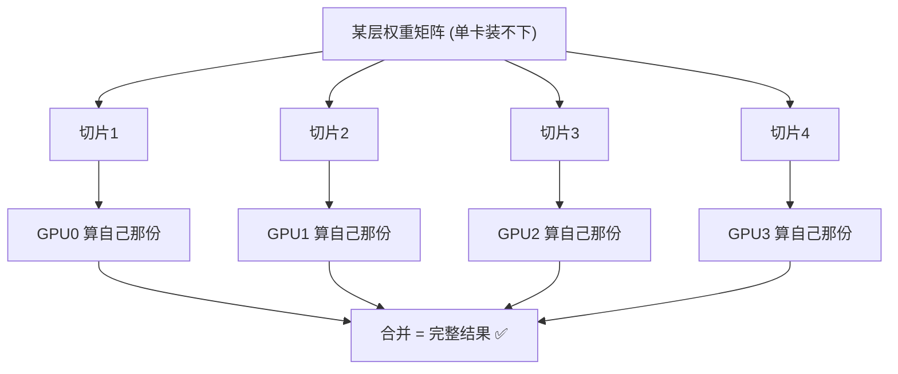
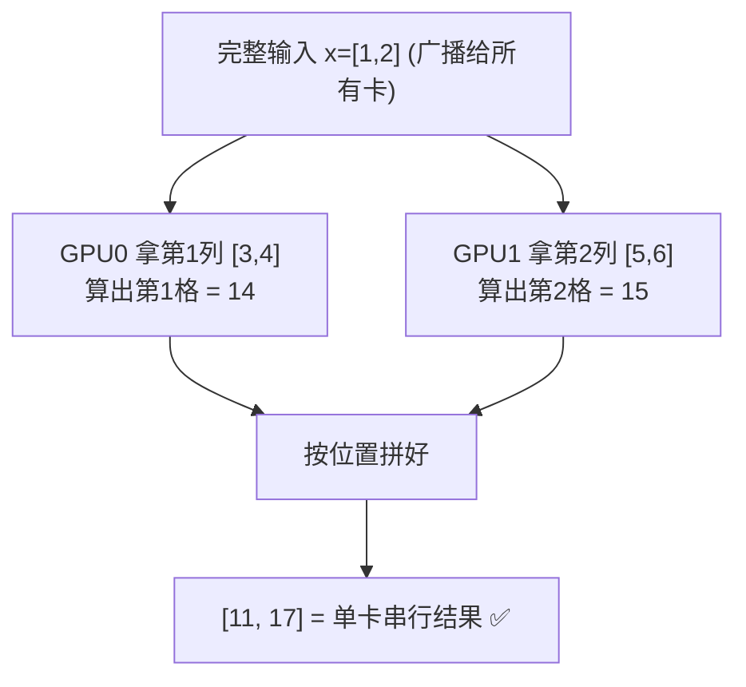
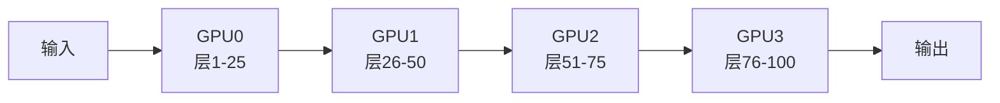
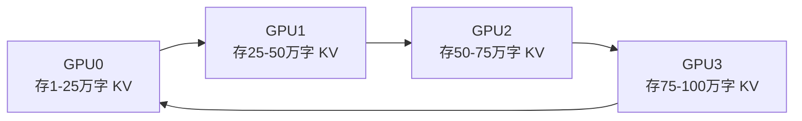
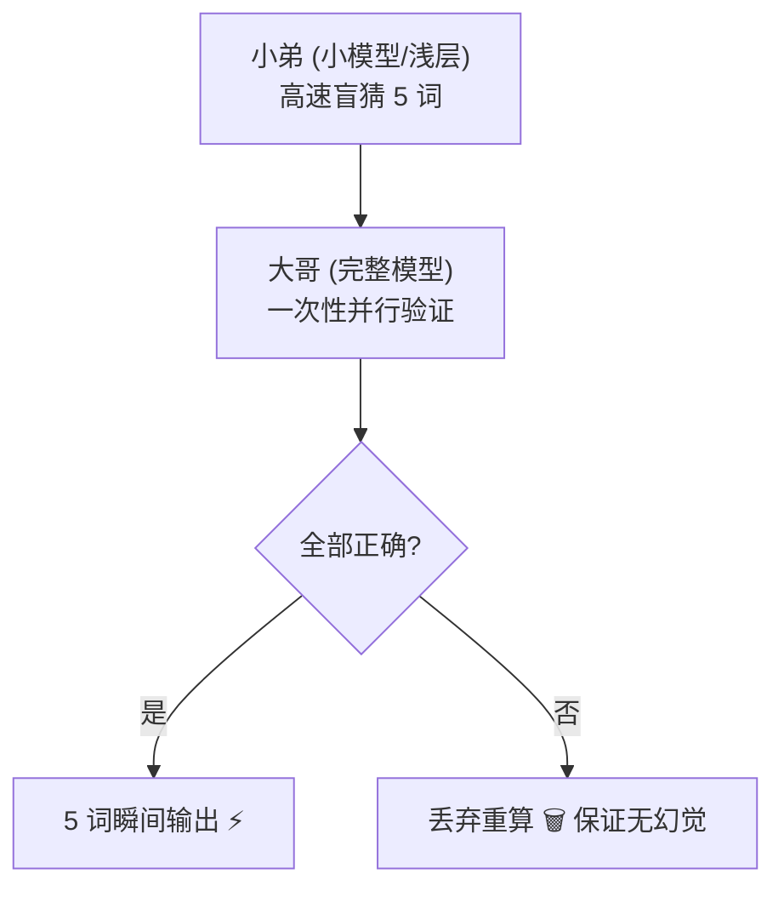

# 📝 大模型推理与缓存机制笔记

## 一、缓存怎么实现：存下运算结果，下次直接当入参 🧮

**本质**：大模型推理是一串矩阵运算。缓存 = 把之前算好的中间结果（KV 矩阵向量）存下来；下次算新内容时，把这些向量**直接当入参丢进下游公式**，历史原文不再重算。

**根本原因**：运算是确定性的——同样的文字 + 同样的模型权重，算出的中间结果必然相同；且历史文字的中间结果只取决于它自己，与后面问什么无关，所以可以存下来反复复用。

**例子（草稿纸）**：连环数学题，第一步算出中间结果 X=5 写在草稿纸上；第二步直接拿 5 当入参继续算，不会重新推导 X 怎么来的。缓存就是"草稿纸上的数字"，大模型读的是数字，不是原文。

## 二、缓存的两种用法：隐式 vs 显式 🔀

**隐式（系统自动复用前缀）**：

**例子**：System Prompt"你是专业客服"每轮自动复用，不用改代码。

**显式（主动寄存，凭 ID 取用）**：

**例子**：全公司员工提问都带同一个 ID，与会话 ID 无关。

## 三、一台机器装不下时：多机怎么协作 🏭

**痛点**：对话越长，"握手"次数越多（生成变慢），KV 向量越积越多（撑爆显存）。

**前提**：矩阵乘法天然支持"分块算、再合并"——分开算与一台机器串行算**数学上完全等价**，所以"大公式"才能拆给多台机器。

### 1. 张量并行（切参数矩阵）🧩

**例子**：4 人分算一张巨型乘法表，每人算 1/4，拼起来等于一人算完。

**为什么拼起来不会出问题？**

- 每张卡算的不是"完整答案的草稿"，而是**答案中某几个格子的精确值**。
- 输出的每个格子，数学上只由"完整输入 × 权重矩阵的对应一列"决定。每张卡都拿到完整输入、只负责几列，算出的就是那几格的真实值，不含近似。
- 合并不是取平均或互相修正，而是把精确值按位置拼好，像拼图归位。

**数字例子**：输入 x = [1, 2]，权重 W = [[3, 5], [4, 6]]，单卡串行结果 = [11, 17]。

**补充**：也可以横着切——每卡拿部分输入和部分权重，算"部分贡献值"，最后相加（乘法分配律，同样精确）。业界实际两种切法组合使用。

### 2. 流水线并行（切网络层）🏭

**例子**：汉堡工厂 A 做面包、B 煎肉饼、C 组装、D 打包；微批处理让多个"汉堡"同时在线上流动，所有卡不闲着。

**为什么等价**：模型的层本来就是逐层串行执行的，切层只是让不同机器接力执行同一条计算链，每步计算内容不变，天然等价。唯一问题是效率（有卡空等），用微批处理解决。

### 3. 上下文并行（切长文本，环形传阅 KV）🔄

**例子**：4 人各持 1/4 会议纪要，围成一圈传阅；传完一圈每人都"读"过全部纪要，手里只存 1/4。

**为什么等价**：注意力是"新词与历史词逐个握手"，而握手可以分段算、再累加（像累加求和）。每卡先算新词与自己那段的局部握手，KV 沿环传阅时逐段累加局部结果，传完一圈 = 单卡看完全文的结果。

### 4. 调度约束 📦

- KV 向量绑定初始机器的显存，生成中途无法迁移（搬数据比重算还慢）。
- 显存不够时，把部分 KV 临时搬到内存（Swapping）：牺牲速度保不崩。
- 传统分布式"多跑几份取最快"的冗余思路，在大模型里因自回归强依赖和算力昂贵不直接采用，而是演化为下面的推测解码。

## 四、推测解码提速 🚀

**例子**：猜"今天天气真不错"全对 → 瞬间输出；猜"烤地瓜"错 → 丢弃重算。

**接受率**：代码/数学等规律性场景命中率高 → 提速显著；闲聊命中率低 → 校验开销可能拖慢。

**演进（Early Exit）**：大哥前 20 层当小弟，与深层共享同一份完整 KV 向量，解决独立小模型"缺上下文"的痛点。